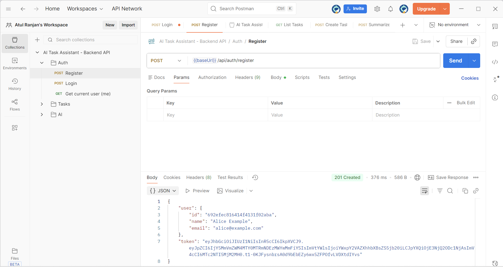

# 🚀 AI-Powered Task Assistant (MERN + AI)

A full-stack AI-powered task management system built using the **MERN stack** with intelligent features powered by **Gemini AI**.  
This project helps users create, manage, and optimize tasks efficiently using AI-based automation.

---

# 🌟 Features

## 🔐 Authentication
- Secure JWT-based login & registration
- Protected routes for authorized users only

## 📝 Task Management
- Create, update, complete, and delete tasks
- Task status tracking: Pending, In Progress, Completed
- Stats dashboard showing dynamic counts

## 🤖 AI (Powered by Gemini API)
- **Task Summarization**
- **Automatic Category Prediction**
- **AI Deadline Estimation**

## 🎨 Frontend (React + TailwindCSS)
- Clean and modern UI
- Interactive Task Dashboard
- AI suggestion buttons inside Task Form

## 🛢 Backend (Node.js + Express)
- MongoDB with Mongoose Schema validation
- AI-powered API routes
- Secured architecture

---

# 📁 Project Structure

AI-Powered Task Assistant
│
├── backend/
│ ├── controllers/
│ ├── middleware/
│ ├── models/
│ ├── routes/
│ └── server.js
│
├── frontend/
│ ├── src/
│ └── vite.config.js
│
├── screenshots/
│
└── README.md


---

# ⚙️ Tech Stack

### Frontend  
- React  
- TailwindCSS  
- Vite  
- Axios  

### Backend  
- Node.js  
- Express.js  
- MongoDB (Mongoose)  
- Gemini API Integration  
- JWT Authentication  

### Tools  
- Postman  
- Git / GitHub  
- VS Code  

---

# 📸 Screenshots

Add your screenshots inside the `/screenshots` folder and GitHub will display them below.

---

## 🖼️ 1. Task Creation Screen  
Shows the Task Form with AI Suggest buttons.


---

## 🧠 2A. AI Suggest – Before  
Long description entered, summary/category empty.


---

## 🤖 2B. AI Suggest – After  
Shows AI auto-filled summary/category/deadline.


---

## 📋 3. Task List + Stats Overview  
Dynamic stats and task cards.


---

## 🔐 4. Login Screen  
User login interface.


---

## 📝 5. Register Screen  
New user registration form.


---

## 🟧 6. Postman – Login Success  
Shows backend authentication working with token.



---

## 🧪 7. Postman – AI Summarize  
Gemini AI generating a summary response.


---

## 🛠 8. Postman – Create Task API  
Backend task creation tested via Postman.


---

# ▶️ Installation & Setup

## 🟦 Backend Setup
```bash
cd backend
npm install

Create .env

MONGO_URI=your_mongodb_uri
JWT_SECRET=your_secret
GEMINI_API_KEY=your_api_key
PORT=5000

Run:

npm start
Backend runs at → http://localhost:5000

🟩 Frontend Setup

cd frontend
npm install

Create .env
VITE_API_BASE=http://localhost:5000

Run:
npm run dev
Frontend runs at → http://localhost:3000

🔌 API Overview
Auth APIs
POST /api/auth/register
POST /api/auth/login
GET  /api/auth/me

Task APIs
GET    /api/tasks
POST   /api/tasks
PATCH  /api/tasks/:id
DELETE /api/tasks/:id

AI APIs (Gemini)
POST /api/ai/summarize
POST /api/ai/categorize
POST /api/ai/estimate-deadline
POST /api/ai/chat


📬 Postman Collection
A Postman collection is included here:
AI_Task_Assistant.postman_collection.json
Use this to test all APIs easily.


🧠 Learning Outcomes
MERN stack development
REST API design
Gemini AI integration
React UI development
Database schema design
Postman API testing

🙌 Author
Atul Ranjan